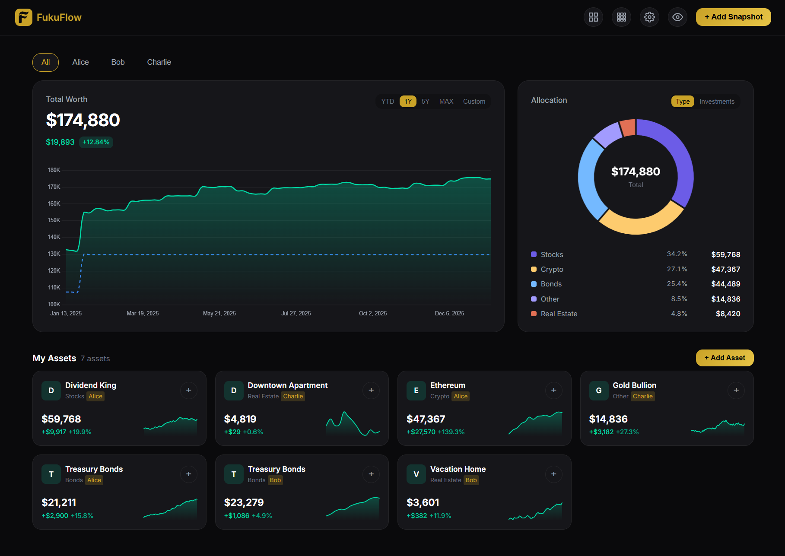
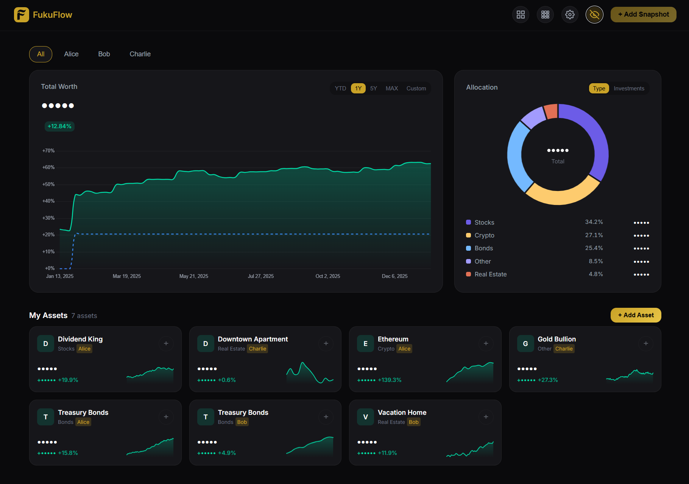
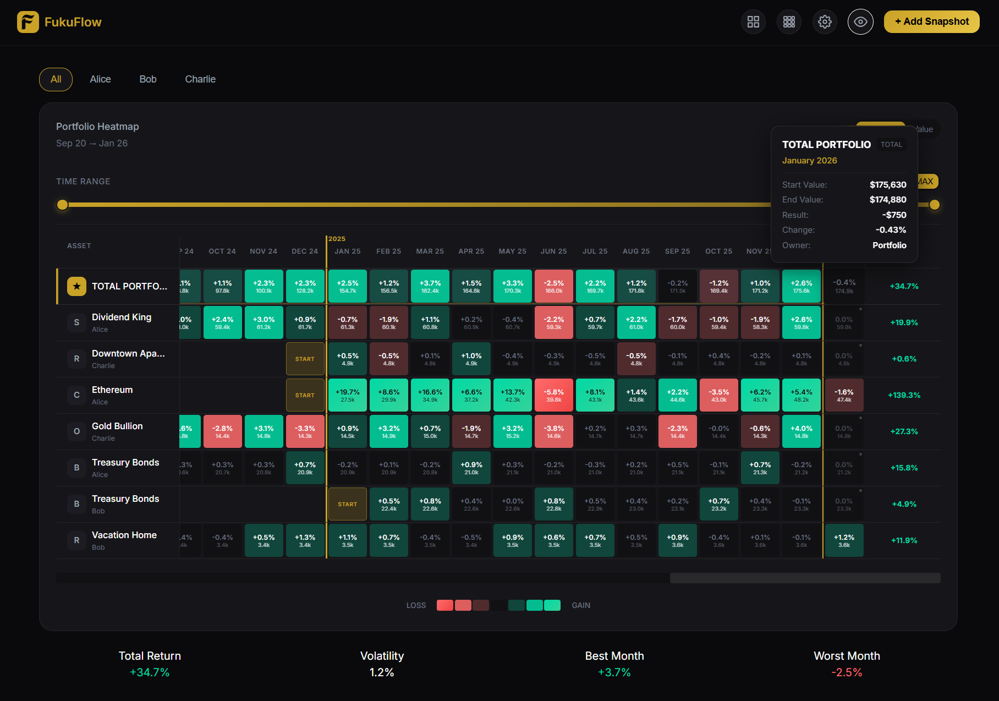

# FukuFlow - Personal Wealth Management

A modern, elegant personal wealth management dashboard for tracking investments across multiple asset categories and family members.

> [!NOTE]
> This application was vibe-coded with Antigravity. 🛸✨

   

## Screenshots
Dashboard


Private Mode


Heatmap


Dark | Light | High Contrast Themes


## Features

### Dashboard & Visualization
- 📊 **Dashboard** - Visualize total worth and performance with interactive charts.
- 📈 **Sparklines** - Performance graphs on investment cards for trend analysis.
- 🗺️ **Portfolio Heatmap** - Monthly performance heatmap showing percentage changes across assets.
- 🍰 **Asset Allocation** - View allocation by Category or Individual Investment.

### Asset Management
- 👨‍👩‍👧‍👦 **Multi-Person Management** - Manage portfolios for multiple family members.
- 🕒 **Snapshot System** - Track asset value history, cumulative gains/losses, and notes.
- 🔍 **Synced Filters** - Filter settings sync across Dashboard and Heatmap views.

### Data & Privacy
- 📁 **CSV Import** - Bulk import snapshot history with support for multiple date formats.
- 💾 **Backup & Restore** - Full database backup export and restore functionality.
- 🔒 **Privacy Mode** - Hide financial values while maintaining trend visibility.

### User Experience
- ⚙️ **Settings** - Centralized management for General, People, Categories, and Backups.
- 🎨 **User Interface** - Dark theme with responsive design for mobile and desktop.

## Why "FukuFlow"?

The name combines two concepts:
*   **Fuku (福)**: Japanese for "good fortune", "wealth", or "luck".
*   **Flow**: Represents the steady movement and management of assets.

Together, it symbolizes the continuous flow of good fortune and wealth management.

## Tech Stack

| Layer | Technology |
|-------|------------|
| Frontend | React 18, TypeScript, Vite |
| Charts | Chart.js, react-chartjs-2 |
| Backend | Node.js, Express |
| Database | SQLite3 |

### Docker Deployment (Recommended)

**Prerequisites:**
- Docker
- Docker Compose

**1. Quick Setup**

Run the setup script to automatically configure your environment:
```bash
node scripts/setup.cjs
```

This will:
- Copy `.env.example` to `.env`
- Generate a secure `JWT_SECRET` automatically

**2. Run the Application**

Build and start the container:
```bash
docker-compose up -d --build
```

The application will be available at `http://localhost:3001`.

### Local Development (Manual)


### Prerequisites

- Node.js 18 or higher
- npm or yarn

### Installation

```bash
# Clone the repository
git clone <repository-url>
cd Wealth-Management

# Install frontend dependencies
npm install

# Install backend dependencies
cd server
npm install
cd ..
```

### Running the Application

**1. Start the Backend Server:**

```bash
node server/index.js
```

The server runs on `http://localhost:3001`

**2. Start the Frontend (in a new terminal):**

```bash
npm run dev
```

The app opens at `http://localhost:5173`

### Building for Production
#### Web Build
```bash
npm run build
```
The build output is in the `dist/` folder.

#### Standalone Executable (.exe)
To package the application as a single portable executable file (server + frontend bundled):

```bash
npm run build:full
```
This command will:
1. Generate the tray icon (`server/logo.ico`)
2. Build the React frontend (`dist/`)
3. Package the Node.js server and dependencies using `pkg`
4. Patch the executable to run without a console window

The output is `fukuflow.exe` in the `dist-exe/` folder.

**Running the Executable:**
- Double-click `fukuflow.exe` to start the server
- The application runs in the background with a **System Tray icon** (gold "F")
- Right-click the tray icon to:
  - **Open FukuFlow** - Launch in browser
  - **Run at Startup** - Toggle Windows auto-start
  - **Exit** - Stop the server
- Data is stored in `%APPDATA%\FukuFlow\wealth.db`

**Note on Windows:** This process automatically handles downloading the correct SQLite3 native bindings for the bundled Node.js runtime.


### Generating Sample Data

To populate the database with realistic sample data for testing:

```bash
node scripts/generate_sample_data.cjs
```

This will create 3 users (Alice, Bob, Charlie) with 6 years of randomized monthly history for various assets including Stocks, Crypto, Real Estate, and Bonds.

### Clearing Sample Data

To remove the generated sample users and their data:

```bash
node scripts/clear_sample_data.cjs
```


## Project Structure

```
Wealth-Management/
├── server/
│   ├── index.js          # Express server entry point
│   ├── db.js             # Database initialization
│   ├── routes/           # API route handlers
│   │   ├── assets.js     # Asset CRUD operations
│   │   ├── persons.js    # Person management
│   │   ├── categories.js # Category management
│   │   ├── snapshots.js  # Snapshot operations
│   │   ├── settings.js   # App settings
│   │   └── backup.js     # Backup & restore
│   ├── seed.js           # Sample data seeder
│   └── db/wealth.db      # SQLite database (auto-created)
├── src/
│   ├── components/       # React components
│   │   ├── settings/     # Settings sub-components
│   │   └── ...           # Dashboard, Charts, Modals
│   ├── contexts/         # React contexts (Privacy)
│   ├── hooks/            # Custom hooks (usePortfolio)
│   ├── lib/              # API client
│   ├── styles/           # Modular CSS files
│   ├── types/            # TypeScript definitions
│   ├── utils/            # Utility functions
│   └── App.tsx           # Main application
├── package.json
└── README.md
```

## API Endpoints

### Persons
| Method | Endpoint | Description |
|--------|----------|-------------|
| GET | `/api/persons` | List all persons |
| POST | `/api/persons` | Add a new person |
| PUT | `/api/persons/:id` | Update a person |
| DELETE | `/api/persons/:id` | Delete a person |
| PUT | `/api/persons/reorder` | Reorder persons |

### Assets
| Method | Endpoint | Description |
|--------|----------|-------------|
| GET | `/api/assets` | List all assets with history |
| POST | `/api/assets` | Add a new asset |
| PUT | `/api/assets/:id` | Update an asset |
| DELETE | `/api/assets/:id` | Delete an asset |

### Snapshots
| Method | Endpoint | Description |
|--------|----------|-------------|
| POST | `/api/assets/:id/snapshot` | Add a value snapshot |
| PUT | `/api/snapshots/:id` | Update a snapshot |
| DELETE | `/api/snapshots/:id` | Delete a snapshot |

### Categories
| Method | Endpoint | Description |
|--------|----------|-------------|
| GET | `/api/categories` | List all categories |
| POST | `/api/categories` | Add a new category |
| PUT | `/api/categories/:id` | Update a category |
| DELETE | `/api/categories/:id` | Delete a category |

### Settings & Backup
| Method | Endpoint | Description |
|--------|----------|-------------|
| GET | `/api/settings` | Get app settings |
| PUT | `/api/settings` | Update app settings |
| GET | `/api/backup` | Export database backup |
| POST | `/api/backup/restore` | Restore from backup |


## License

MIT
