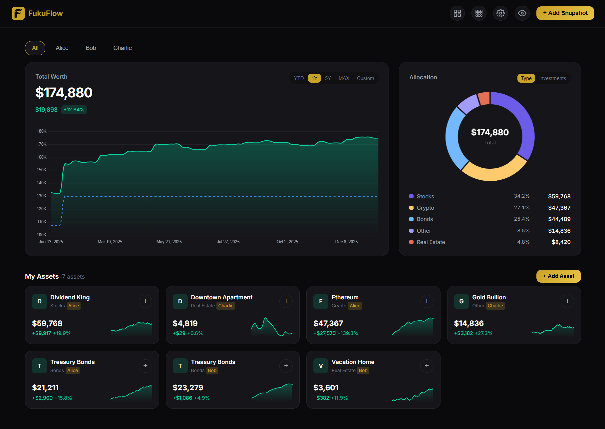
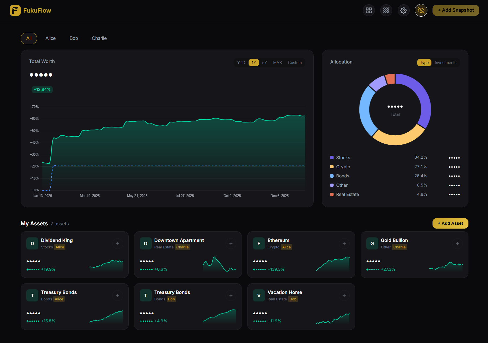
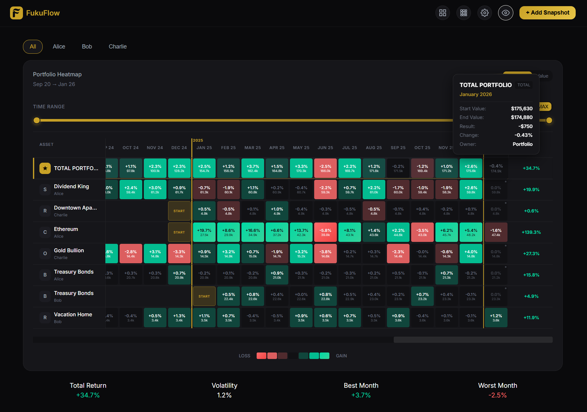
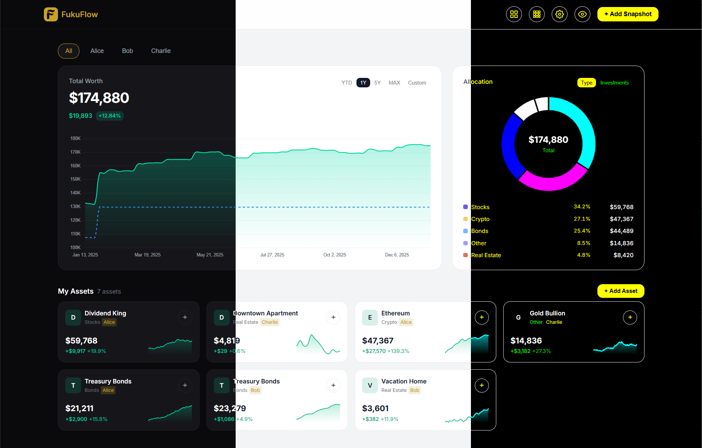

# FukuFlow - Personal Wealth Management

A modern, elegant personal wealth management dashboard for tracking investments across multiple asset categories and family members.

   

## Screenshots
Dashboard


Private Mode


Heatmap


Dark | Light | High Contrast Themes


## Features

### Dashboard & Visualization
- 📊 **Dashboard** - Visualize total worth and performance with interactive charts.
- 🔀 **Performance / Total Worth Views** - Toggle the main chart between absolute portfolio value and period return (rebased to 0% at the start of the selected range); your choice is remembered.
- 📈 **Sparklines** - Performance graphs on investment cards for trend analysis.
- 📉 **Performance Metrics** - CAGR, Max Drawdown, and Volatility displayed below each chart, calculated net of cash flows.
- 🗺️ **Portfolio Heatmap** - Monthly performance heatmap showing percentage changes across assets.
- 🍰 **Asset Allocation** - View allocation by Category or Individual Investment.

### Asset Management
- 👨‍👩‍👧‍👦 **Multi-Person Management** - Manage portfolios for multiple family members.
- 🕒 **Snapshot System** - Track asset value history, cumulative gains/losses, and notes.
- 🔍 **Synced Filters** - Filter settings sync across Dashboard and Heatmap views.

### Data & Privacy
- 📁 **CSV Import** - Bulk import snapshot history with support for multiple date formats.
- 💾 **Backup & Restore** - Full database backup export and restore functionality.
- 🔒 **Privacy Mode** - Hide financial values while maintaining trend visibility.

### Onboarding & First Run
- 🚀 **Guided Setup Wizard** - On a fresh install, a wizard walks you from an empty app to a populated, configured dashboard: preferences (currency/theme) → household → first asset → first value. Add multiple family members, capture the amount invested with a live profit/loss preview, step **Back** at any point, and resume where you left off after a reload.
- 🏁 **Get Started Hero** - While the portfolio is empty, a prominent, dismissible card guides you to your first investment, then steps aside once you add one.
- ✅ **Live Password Checklist** - First-run password setup shows a real-time requirements checklist that mirrors the backend policy, so the rules are never a guess.

### User Experience
- ⚙️ **Settings** - Centralized management for General, People, Categories, and Backups.
- 🎨 **Themes** - Light, Dark, and High Contrast themes with responsive design for mobile and desktop.

## Why "FukuFlow"?

The name combines two concepts:
*   **Fuku (福)**: Japanese for "good fortune", "wealth", or "luck".
*   **Flow**: Represents the steady movement and management of assets.

Together, it symbolizes the continuous flow of good fortune and wealth management.

## Tech Stack

| Layer | Technology |
|-------|------------|
| Frontend | React 19, TypeScript, Vite |
| Charts | Chart.js, react-chartjs-2 |
| Backend | Node.js, Express |
| Database | SQLite3 |

### Deployment & CI/CD

#### Option 1: Quick Start (Pre-built Image)
Use this if you just want to run the application without building it from source.

Run the following command in your terminal:
```bash
docker run -d -p 3001:3001 -v fukuflow-data:/app/server/db -e JWT_SECRET=change_me_to_something_secret --name fukuflow-app ghcr.io/gartur/fukuflow:latest
```
*Note: Replace `change_me_to_something_secret` with a real secret string.*
The application will be available at `http://localhost:3001`.

**Available image tags**

| Tag | Points to | Use it for |
|---|---|---|
| `:latest` | Newest **stable release** | Most users - pull this. |
| `:edge` | Latest build off `main` | Trying unreleased changes (may be unstable). |
| `:1.2.3` / `:1.2` / `:1` | A specific release / rolling major or minor | Pinning a deployment for reproducibility. |
| `:sha-<short>` | An exact commit build | Debugging / pinning to one precise build. |

**Updating to the Latest Version**
To update the container to the newest version:
```bash
# 1. Pull the latest image
docker pull ghcr.io/gartur/fukuflow:latest

# 2. Stop and remove the old container
docker stop fukuflow-app
docker rm fukuflow-app

# 3. Start the new container (same command as above)
docker run -d -p 3001:3001 -v fukuflow-data:/app/server/db -e JWT_SECRET=change_me_to_something_secret --name fukuflow-app ghcr.io/gartur/fukuflow:latest

# Note: The '-v fukuflow-data:/app/server/db' flag ensures your database (wealth.db) persists 
# in the 'fukuflow-data' volume, so you will NOT lose data when deleting the old container.
```

#### Option 2: Build from Source (Docker Compose)
Use this if you want to develop or customize the build.

The application is fully containerized. You can run it locally or deploy it using the provided `docker-compose.yml`.

**1. Configuration**
Copy the example environment file:
```bash
cp .env.example .env
```
Edit `.env` to set your preferences (ports, secrets, etc.).

**2. Local Run**
```bash
docker-compose up -d --build
```
The app will be available at `http://localhost:3001`.

**3. Updating the Application**
To update to the latest version:
```bash
# 1. Get the latest code
git pull

# 2. Rebuild and restart the container
docker-compose up -d --build
```

**Continuous Integration (CI)**
This project uses GitHub Actions for CI/CD:
- **Triggers**: Pull requests to `main`, pushes to `main`, and version tags (`v*.*.*`).
- **Checks**: Linting (ESLint), Formatting (Prettier), Type Checking (TypeScript), Frontend unit tests (Vitest), Backend integration tests (Vitest + Supertest).
- **Artifacts**: Builds a Docker image on every run and pushes it to **GitHub Container Registry (GHCR)** (`ghcr.io/<owner>/fukuflow`) on pushes to `main` and on version tags. Pushes to `main` publish `:edge` (plus `:sha-<short>`); a `v*.*.*` tag publishes the matching semver tags and moves `:latest` to that release (see the image-tags table above). Pushed images carry SBOM and build-provenance attestations.
- **Image retention**: A weekly scheduled workflow prunes untagged manifests and old `:sha-<short>` builds from GHCR; `:latest`, `:edge`, and semver tags are never deleted.

### Local Development (Manual)


### Prerequisites

- Node.js 24 or higher
- npm or yarn

### Installation

```bash
# Clone the repository
git clone <repository-url>
cd FukuFlow

# Install frontend dependencies
npm install

# Install backend dependencies
cd server
npm install
cd ..
```

### Running the Application

**Quick Start (Recommended for Development):**

```bash
# Start both frontend and backend simultaneously
npm run dev:all
```
This will start the backend on `http://localhost:3001` and the frontend on `http://localhost:5173`.

**Manual Control:**

**1. Start the Backend Server:**

```bash
npm run dev:server
```

The server runs on `http://localhost:3001`

**2. Start the Frontend (in a new terminal):**

```bash
npm run dev
```

The app opens at `http://localhost:5173`

### Testing

#### Unit Tests (Frontend)
```bash
npm test
```
Runs Vitest against React components, hooks, and utility functions. No server required.

#### Unit & Integration Tests (Backend)
```bash
npm run test:server
```
Runs Vitest + Supertest against an in-memory SQLite database. No external dependencies required.

#### E2E Tests (Playwright)
Playwright drives a real Chromium browser against a live dev server using an isolated test database.

**Prerequisites** (first time only):
```bash
npx playwright install chromium
```

**Run headless (CI-style):**
```bash
npm run test:e2e
```

**Run with browser visible:**
```bash
npm run test:e2e:headed
```

**Interactive UI mode (step through tests):**
```bash
npm run test:e2e:ui
```

**Debug a single test:**
```bash
npm run test:e2e:debug
```

**View HTML report after a run:**
```bash
npx playwright show-report e2e/playwright-report
```

The E2E suite starts both the backend (port 3001) and the Vite dev server (port 5173) automatically via `webServer` in [`playwright.config.ts`](playwright.config.ts). Tests use an isolated database at `server/db/e2e-test.db` that is created fresh each run.

### Building for Production
#### Web Build
```bash
npm run build
```
The build output is in the `dist/` folder.

#### Standalone Executable (.exe)
To package the application as a single portable executable file (server + frontend bundled):

```bash
npm run build:full
```
This command will:
1. Generate the tray icon (`server/logo.ico`)
2. Build the React frontend (`dist/`)
3. Package the Node.js server and dependencies using `pkg`
4. Patch the executable to run without a console window

The output is `fukuflow.exe` in the `dist-exe/` folder.

**Running the Executable:**
- Double-click `fukuflow.exe` to start the server
- The application runs in the background with a **System Tray icon** (gold "F")
- Right-click the tray icon to:
  - **Open FukuFlow** - Launch in browser
  - **Run at Startup** - Toggle Windows auto-start
  - **Exit** - Stop the server
- Data is stored in `%APPDATA%\FukuFlow\wealth.db`

**Note on Windows:** This process automatically handles downloading the correct SQLite3 native bindings for the bundled Node.js runtime.


### Generating Sample Data

To populate the database with realistic sample data for testing:

```bash
node scripts/generate_sample_data.cjs
```

This will create 3 users (Alice, Bob, Charlie) with 6 years of randomized monthly history for various assets including Stocks, Crypto, Real Estate, and Bonds.

### Clearing Sample Data

To remove the generated sample users and their data:

```bash
node scripts/clear_sample_data.cjs
```


## Project Structure

```
FukuFlow/
├── server/
│   ├── index.js          # Express server entry point
│   ├── db.js             # Database initialization
│   ├── routes/           # API route handlers
│   │   ├── assets.js     # Asset CRUD operations
│   │   ├── persons.js    # Person management
│   │   ├── categories.js # Category management
│   │   ├── snapshots.js  # Snapshot operations
│   │   ├── settings.js   # App settings
│   │   └── backup.js     # Backup & restore
│   ├── middleware/       # Auth middleware
│   ├── tests/            # Backend integration tests
│   └── db/wealth.db      # SQLite database (auto-created)
├── src/
│   ├── components/       # React components
│   │   ├── heatmap/      # Heatmap sub-components
│   │   ├── settings/     # Settings sub-components
│   │   └── ...           # Dashboard, Charts, Modals
│   ├── contexts/         # React contexts (Auth, Settings, Privacy)
│   ├── hooks/            # Custom hooks (usePortfolio, usePersons, ...)
│   ├── lib/              # API client
│   ├── styles/           # Modular CSS files and themes
│   ├── types/            # TypeScript definitions
│   ├── utils/            # Utility functions (performance, heatmap, ...)
│   └── App.tsx           # Main application
├── e2e/                  # Playwright E2E tests
├── scripts/              # Sample data generation scripts
├── .github/              # CI workflow and PR template
├── package.json
└── README.md
```

## API Endpoints

### Authentication
| Method | Endpoint | Description |
|--------|----------|-------------|
| GET | `/api/auth/status` | Check setup and auth status |
| POST | `/api/auth/setup` | Initial password setup |
| POST | `/api/auth/login` | Login and receive JWT token |
| POST | `/api/auth/logout` | Invalidate current token |
| POST | `/api/auth/change-password` | Change password |

### Persons
| Method | Endpoint | Description |
|--------|----------|-------------|
| GET | `/api/persons` | List all persons |
| POST | `/api/persons` | Add a new person |
| PUT | `/api/persons/:id` | Update a person |
| DELETE | `/api/persons/:id` | Delete a person |
| PUT | `/api/persons/reorder` | Reorder persons |

### Assets
| Method | Endpoint | Description |
|--------|----------|-------------|
| GET | `/api/assets` | List all assets with history |
| POST | `/api/assets` | Add a new asset |
| PUT | `/api/assets/:id` | Update an asset |
| DELETE | `/api/assets/:id` | Delete an asset |

### Snapshots
| Method | Endpoint | Description |
|--------|----------|-------------|
| POST | `/api/assets/:id/snapshot` | Add a value snapshot |
| PUT | `/api/snapshots/:id` | Update a snapshot |
| DELETE | `/api/snapshots/:id` | Delete a snapshot |

### Categories
| Method | Endpoint | Description |
|--------|----------|-------------|
| GET | `/api/categories` | List all categories |
| POST | `/api/categories` | Add a new category |
| PUT | `/api/categories/:id` | Update a category |
| DELETE | `/api/categories/:id` | Delete a category |

### Settings & Backup
| Method | Endpoint | Description |
|--------|----------|-------------|
| GET | `/api/settings` | Get app settings |
| PUT | `/api/settings` | Update app settings |
| GET | `/api/backup` | Export database backup |
| POST | `/api/backup/restore` | Restore from backup |


## License

MIT
